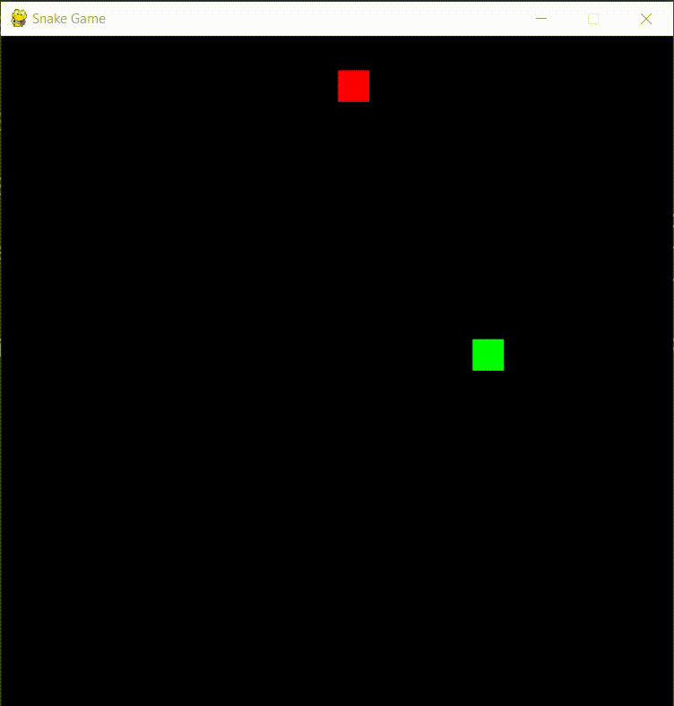

# Snake Game in Python with Pygame



This is a simple explanation of how to set up and play the "Snake Game" developed using Python3 and Pygame.

## Prerequisites

Make sure your system meets the following conditions before proceeding:

- **Python**: Install version 3.7 or higher. This project has only been tested on versions 3.10, 3.11, and 3.12+.
- **Pip**: Ensure you have the latest version installed for managing Python packages.
- **Git**: Make sure you have the most recent Git client installed for cloning repositories.

## Instructions

Follow these steps to download, install dependencies, and play the game:

1. Open your terminal or command prompt and navigate to the desired location where you want to store the project. Run the following command to clone the repository:

    ```bash
    git clone https://github.com/AshkanFeyzollahi/snake-game.git
    ```

2. Navigate to the newly created snake-game folder:

    ```bash
    cd snake-game
    ```

3. In the terminal or command prompt, install the required dependencies by running either of these commands based on your operating system:

- For **Windows**, enter:

    ```bash
    python -m pip install -r requirements.txt
    ```

- For **Linux** or **macOS**, enter:

    ```bash
    python3 -m pip install -r requirements.txt
    ```

Once all dependencies are installed, you're ready to play the game! In the same terminal or command prompt window, run one of these commands depending on your OS:

- For **Windows**, enter:

    ```bash
    python main.py
    ```

- For **Linux** or **macOS**, enter:

    ```bash
    python3 main.py
    ```

## Controls

During gameplay, control the snake as follows:

- Up Arrow / W Key: Move the snake upward.
- Down Arrow / S Key: Direct the snake downward.
- Left Arrow / A Key: Guide the snake to move leftwards.
- Right Arrow / D Key: Steer the snake rightwards.

Enjoy the challenge of growing your snake longer without crashing into its own body or the game borders! Good luck!

## Troubleshooting

Should you encounter any issues during gameplay, please don't hesitate to report them by opening an issue within the project's GitHub page.
